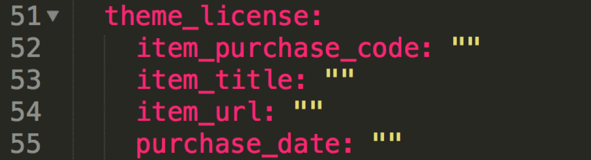
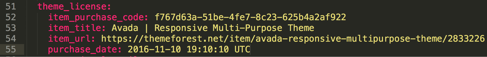

This process is to be completed after provisioning the site and once you know which WordPress theme you are using.

To find the theme license, go to https://themeforest.net/downloads and locate the theme you are set to use (eg. - Enfold, Avada, etc.). Login information is located in drud secret under - `1fee/sites/account.envato.com`

- Click the 'Download' button and a dropdown appears.
- Download 'All files and documentation' to download the zip file for the theme and either the pdf or text version of the file, 'License certificate and purchase code.'
- Within the 'License certificate and purchase code' file, locate the following fields:
  - Item Title
  - Item URL
  - Item Purchase Code
  - Purchase Date
- In iTerm enter the following command: `drud secret edit databags/drudhosting/<site-name>`
  - After entering this command, your text editor (eg. Atom) will open automatically.
- In your text editor, locate the section 'theme_license' and update the four fields (default quotes are not necessary).

See example below:

- Save the file and then you MUST close out of the text editor.
- Go back to iTerm and you should see the following, 'Secret written to vault.'
- To verify, enter: `drud secret read databags/drudhosting/<site-name>` and the updated fields will be located under client_metadata.

Completed example:

